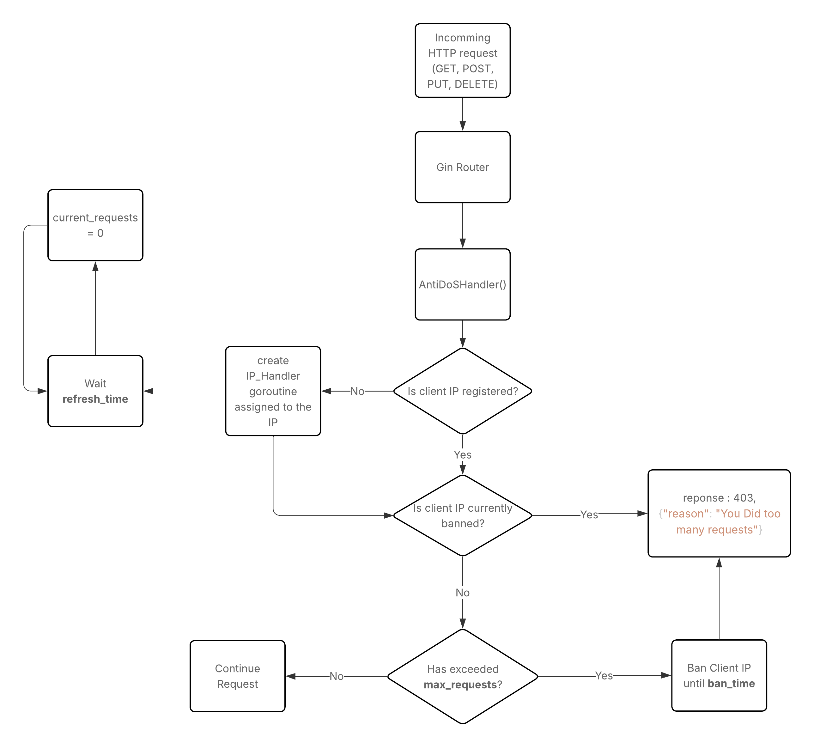

[](https://git.io/typing-svg)

# 🛠️ How It Works?
### 🧩 Parameters
- **ban_time**: How long an IP stays banned once it exceeds the allowed number of requests.
- **max_requests**: Maximum number of requests an IP can make within a **refresh_time** window.
- **refresh_time**: Time window used for counting requests per IP.
### 📊 Flowchart



<br>

# 🚀 Basic Usage
## Creating a Default Engine
To create a engine without specify the params you can use the function **DefaultDoSEngine**, this function consider the following values:
- **ban_time**: 5 minutes
- **max_requests**: 30
- **refresh_time**: 4 seconds
### Example
```go
package main

import (
  "log"
  "net/http"

  "github.com/RaulacaX/gin-AntiDoS"
  "github.com/gin-gonic/gin"
)

func main() {
	// Create a Gin router with default middleware (logger and recovery)
	r := gin.Default()

	// Create a default DoS engine
	dos_engine := AntiDoS.DefaultDoSEngine() 
    // Use the handler
	r.Use(dos_engine.AntiDoSHandler())

	// Define a simple GET endpoint
	r.GET("/ping", func(c *gin.Context) {
		// Return JSON response
		c.JSON(http.StatusOK, gin.H{
		"message": "pong",
		})
	})

	// Start server on port 8080 (default)
	// Server will listen on 0.0.0.0:8080 (localhost:8080 on Windows)
	if err := r.Run(); err != nil {
		log.Fatalf("failed to run server: %v", err)
	}
}
```
## Creating a Custom Engine
To create a custom engine you must use the function **createDoSEngine** specifying the parametters.
### Example

```go
package main

import (
  "log"
  "net/http"

  "github.com/RaulacaX/gin-AntiDoS"
  "github.com/gin-gonic/gin"
)

func main() {
	// Create a Gin router with default middleware (logger and recovery)
	r := gin.Default()

	// Create a DoS engine with 50 max requests, 20 minutes of ban time and 5 seconds of refresh time
	dos_engine := AntiDoS.CreateDoSEngine(50, 20*Time.Minute, 5*Time.Second) 
	// Use the handler
	r.Use(dos_engine.AntiDoSHandler())


	// Define a simple GET endpoint
	r.GET("/ping", func(c *gin.Context) {
		// Return JSON response
		c.JSON(http.StatusOK, gin.H{
		"message": "pong",
		})
	})

	// Start server on port 8080 (default)
	// Server will listen on 0.0.0.0:8080 (localhost:8080 on Windows)
	if err := r.Run(); err != nil {
		log.Fatalf("failed to run server: %v", err)
	}
}
```
